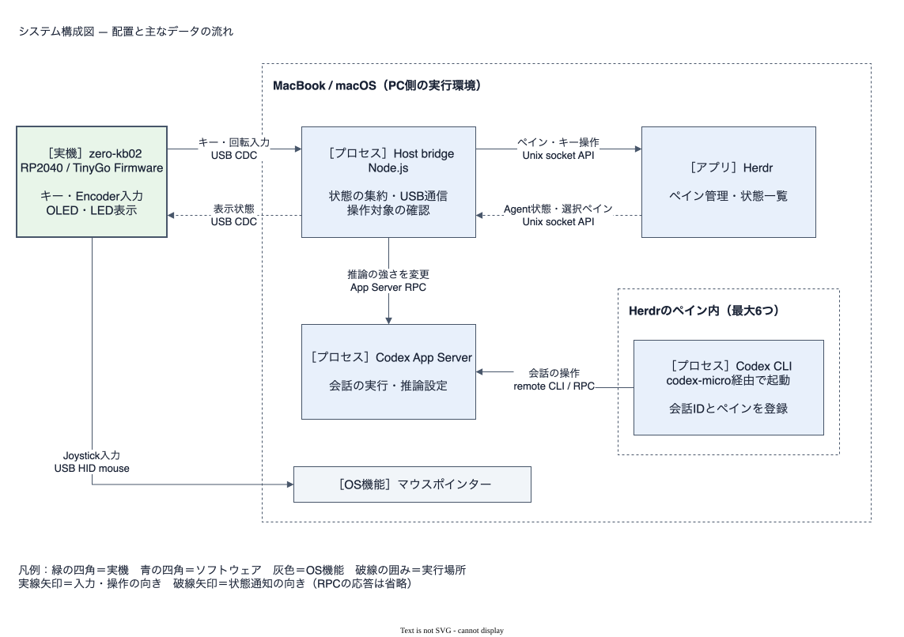

# zero-kb02 Codex controller

[English](README_EN.md)

zero-kb02（RP2040）のキー・Encoder・OLED/LEDで、macOSのHerdr上にある最大6つのCodex CLIを表示・操作する個人用デバイスです。Joystickはマウスポインターを動かします。

[デモ動画（X）](https://x.com/hoki621/status/2093605017819423047) · [検証結果](docs/verification.md)



Firmwareは入力と表示を担当し、HostがHerdrの状態・操作対象を確認します。Encoderによる推論の強さの変更は、専用Codex App Serverを通して行います。構成図のSVGはdraw.ioで編集できます。

## 初期設定

必要なもの: macOS、zero-kb02、Herdr、Homebrew、mise。導入済みの環境はそのまま使えます。Node.js・Go・TinyGoの版は`mise.toml`で固定しています。Codex CLIはHomebrew版を使用します。

```sh
git clone --recurse-submodules https://github.com/hoki621/codex-zero-kb02.git
cd codex-zero-kb02
mise install                 # 指定版が未導入の場合
mise exec -- sh -c 'cd host && npm ci && npm run build'
brew install --cask codex    # 未導入の場合
herdr plugin link --enabled "$PWD/host"
```

Herdrの導入は[公式サイト](https://herdr.dev/)を参照してください。Codex CLIの認証を済ませてから起動します。Launcherはbrew版を選び、既存のCodex設定ファイルを変更しません。

Firmwareのビルド・書き込みは[日本語手順](firmware/README_JA.md)へ。HostとFirmwareはUSB CDC **major 2**の組合せが必要です。旧major 1とは接続できません。

## 起動

以下はリポジトリのルートから実行します。各Terminalで同じ`TMPDIR=/tmp`を指定してください。Herdr内と外で一時ディレクトリが異なると、専用serverを見つけられません。

1. 通常Terminalで専用serverを起動し、そのままにします。

   ```sh
   TMPDIR=/tmp mise exec -- node host/dist/src/codex-micro.js server
   ```

2. Herdrの各ペインで起動します（最大6つ）。再開は末尾に`resume`を付けます。

   ```sh
   TMPDIR=/tmp mise exec -- node host/dist/src/codex-micro.js
   ```

3. 別の通常Terminalでbridgeを起動します。実機の完全なport名を指定し、ほかのserial monitorは閉じます。

   ```sh
   TMPDIR=/tmp HERDR_SOCKET_PATH="$HOME/.config/herdr/herdr.sock" \
   ZERO_KB02_PORT=/dev/cu.usbmodemzero_kb02_v21 \
   mise exec -- node host/dist/src/main.js
   ```

終了はCtrl-Cです。専用serverは利用中のCLIをすべて終了してから止めてください。brewでCodexを更新した場合も、serverを再起動して各ペインを再開します。

## 操作

キー番号は上段左からK1〜K4、中段K5〜K8、下段K9〜K12です。

| 入力 | 動作 |
| --- | --- |
| K1 | 選択中のCodexへEscape |
| K2 / K3 / K5 / K6 / K7 / K8 | Agent 1〜6のペインへ切替 |
| K4 | 状態一覧を開く・閉じる |
| K9 / K10 | 確認できた単独command承認へ固定の承認・拒否を各1回 |
| K11 | 未割当 |
| K12 | 入力待ち・完了のCodexで新しい会話 |
| Encoder | 時計回りで推論の強さを上げ、反時計回りで下げる |
| Joystick | ポインター移動。両pushは未割当 |

OLEDはAgent 1/2、3/4、5/6の2列3段。W=作業中、I=入力待ち、B=承認・回答待ち、D=完了、U=不明、E=空枠です。

K9/K10の対応版はCodex CLI **0.155.1・0.160.0のみ**。会話・terminal・承認要求・表示画面が一致する場合だけ有効です。0.162.0では無効で、撮影前確認でも使用していません。K4はHerdr共通のpopupを閉じることがあります。

## 開発・更新

```sh
mise exec -- sh -c 'cd host && npm run typecheck && npm test && npm run dry-run -- WIBDUE'
mise exec -- sh -c 'cd firmware && go test ./... && go vet ./...'
```

実機なしで確認できます。更新は`git pull --ff-only`、`git submodule update --init --recursive`、Hostの`npm ci`・buildの順です。`git submodule update --remote`は使わず、親commitが固定した組合せを取得します。

- [Hostの詳細・復旧](host/README_JA.md) / [Firmware](firmware/README_JA.md)
- [通信仕様](PROTOCOL.md) / [上流・ライセンス](UPSTREAMS.md)
- [残る確認項目 #32](https://github.com/hoki621/codex-zero-kb02/issues/32)

matrix/debounce・デバイスdriverには固定した公開ライブラリを使います。workshopのコードはコピーしていません。上流由来のソースとライセンスは各子リポジトリに明記しています。本体の独自コードにはまだライセンスを指定していません。
