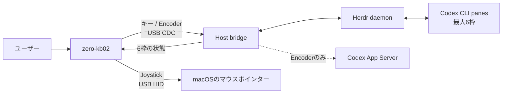

# codex-zero-kb02

zero-kb02から、Herdr上で動くCodex CLIエージェントを確認・操作するための非公式コントローラーです。

- [`host/`](https://github.com/hoki621/codex-zero-kb02-host): HerdrとUSB CDCをつなぐHost bridge
- [`firmware/`](https://github.com/hoki621/codex-zero-kb02-firmware): zero-kb02用TinyGo firmware

このプロジェクトはOpenAI、Work Louder、Herdr、Waveshare、および
[UPSTREAMS.md](UPSTREAMS.md)に記載したupstream projectの公式製品ではなく、提携・推奨を受けたものでもありません。

## できること



Host bridgeはHerdrの状態をzero-kb02へ送り、物理操作を許可済みの固定操作だけに変換します。
任意コマンドや任意文字列を送る機能はありません。

## 物理配置と操作

zero-kb02を正面から見たキー番号です。K1が左上です。

```text
┌────────┬────────┬────────┬────────┐
│ K1     │ K2     │ K3     │ K4     │
│ Escape │ Agent 1│ Agent 2│ Status │
├────────┼────────┼────────┼────────┤
│ K5     │ K6     │ K7     │ K8     │
│ Agent 3│ Agent 4│ Agent 5│ Agent 6│
├────────┼────────┼────────┼────────┤
│ K9     │ K10    │ K11    │ K12    │
│ Approve│ Reject │ 無効   │ /new   │
└────────┴────────┴────────┴────────┘
```

| 操作 | 動作 | 動作条件 |
| --- | --- | --- |
| K1 | Escapeを送る | focus中かつ割り当て済みのCodex pane |
| K2 / K3 | Agent slot 0 / 1へfocus | 対応するagentが存在する |
| K4 | HerdrのStatus popupを開閉 | popupはHerdr session全体で1つ |
| K5 / K6 / K7 / K8 | Agent slot 2 / 3 / 4 / 5へfocus | 対応するagentが存在する |
| K9 | 今回だけApprove（固定キー`y`） | focus中のCodex paneが`blocked` |
| K10 | Reject（固定キー`n`） | focus中のCodex paneが`blocked` |
| K11 | 何もしない | v1では予約済み |
| K12 | New Chat（固定コマンド`/new`） | focus中のCodex paneが`idle`または`done` |
| Encoderを時計回り | reasoning effortを1段階上げる | managed Codex CLIとApp Serverが動作中 |
| Encoderを反時計回り | reasoning effortを1段階下げる | managed Codex CLIとApp Serverが動作中 |
| Encoderを押す | 何もしない | v1ではHost操作なし |
| Joystickを倒す | マウスポインターを上下左右へ移動 | USB HIDとして動作 |
| Joystickを押す | 何もしない | v1では予約済み |

K9/K10は送信直前にもfocus、Codex identity、`blocked`状態、USB sessionを再確認します。
条件が変わった場合は何も送りません。Enterや永続承認は送りません。

## OLEDとLED

OLEDの6枠は、K2/K3/K5〜K8が選ぶAgent slotと同じ順序です。

```text
┌────────┬────────┐
│ slot 0 │ slot 1 │  ← K2 / K3
├────────┼────────┤
│ slot 2 │ slot 3 │  ← K5 / K6
├────────┼────────┤
│ slot 4 │ slot 5 │  ← K7 / K8
└────────┴────────┘
```

| 表示 | 状態 |
| --- | --- |
| `W` | working: 作業中 |
| `I` | idle: 入力待ち |
| `B` | blocked: 承認・回答待ち |
| `D` | done: 完了 |
| `U` | unknown: 状態不明 |
| `E` | empty: agent未割り当て |

## セットアップと起動

### 初回セットアップ

次の1〜3は、最初のセットアップ時だけ実行します。Firmwareを更新・復旧する場合を除き、毎回やり直す必要はありません。

#### 1. Cloneと依存関係の準備

```sh
git clone --recurse-submodules https://github.com/hoki621/codex-zero-kb02.git
cd codex-zero-kb02
mise install
cd host
npm ci
```

このParent commitが検証済みの組み合わせを固定します。

| Component | Commit |
| --- | --- |
| Host | `a60efe2c49d7ea042c023415fb7057707598e047` |
| Firmware | `4d8104c5b4f3925b37394b0ca2d14c39486fc9a1` |

#### 2. Firmwareを書き込む

対象がzero-kb02であることを確認し、実機操作の明示許可を得てから実行します。

```sh
cd ../firmware
tinygo build -o /absolute/path/zero-kb02.uf2 --target waveshare-rp2040-zero --stack-size 8kb --size short .
tinygo flash --target waveshare-rp2040-zero --stack-size 8kb .
```

`tinygo flash`で書き込めない場合は、Host bridgeを停止してから
[`firmware/docs/hardware-diagnostics.md`](firmware/docs/hardware-diagnostics.md)のBOOTSEL/RST手順を使います。

#### 3. Herdr pluginを登録する

これは初回だけ必要です。ローカルの固定manifest `hoki621.zero-kb02`と、読み取り専用のStatus popupを登録します。

```sh
cd ../host
npm run build
herdr plugin link --enabled "$(pwd)"
cd ..
```

このコマンドはHerdrのplugin registryを変更します。Host bridgeが自動実行することはありません。

#### 4. Codex SessionStart連携を登録する

Encoderが操作するCodex threadをpaneへ自動登録するため、Herdr 0.8.2のbuilt-in integrationを1回だけ導入します。

```sh
herdr integration install codex
cd host
npm run install-codex-hook
cd ..
herdr integration status
```

installerは既存の`~/.codex/hooks.json`を置換せず、既存hookを残したままHerdrの`SessionStart` hookを追加します。
続く`npm run install-codex-hook`も既存hookを残し、Codex remoteで`transcript_path`がnullまたはない場合を扱う
zero-kb02用hookを追加します。実行後に`~/.codex/hooks.json`、`~/.codex/herdr-agent-state.sh`、および
追加された`host/dist/src/codex-hook.js`のcommandを確認し、次回Codex起動時のhook trust reviewで許可してください。
`--dangerously-bypass-hook-trust`は使いません。

このhookは`HERDR_ENV=1`、`HERDR_SOCKET_PATH`、対象paneの`HERDR_PANE_ID`がある場合だけ、Codexがstdinへ渡すexact
`session_id`を`agent=codex`、`source=herdr:codex`として登録します。Herdr外、登録失敗、またはHostが
UUIDv7・一意identity・loaded threadを確認できない場合、Encoder操作は何もしません。

### 毎回の起動

zero-kb02をUSB接続し、次の1〜3を順番に実行します。

#### 1. Encoderを使う場合だけApp Serverを起動する

```sh
codex app-server daemon start
```

すでに起動中の場合に`alreadyRunning`と表示されるのは正常です。

Encoder controlはCodex CLI 0.149.1または0.150.1のローカルApp Serverを使います。対象のCodex CLI paneは
下記の`codex-herdr` wrapperで起動してください。

`managed standalone Codex install not found`と表示される環境ではApp Serverを起動できないため、
Encoderによるreasoning effort変更だけが利用できません。K1〜K10とK12、OLED/LED、Status popup、JoystickはApp Serverなしでも動作します。

#### 2. Host bridgeを起動する

Herdr管理paneではなく、macOSの通常Terminalから実行します。Herdr再起動後もbridgeを残すためです。

```sh
cd host
HERDR_SOCKET_PATH="$HOME/.config/herdr/herdr.sock" \
ZERO_KB02_PORT=/dev/cu.usbmodemzero_kb02_v11 \
npm start
```

USB CDC deviceが1台だけなら`ZERO_KB02_PORT`は省略できます。複数ある場合は、必ず対象の
`/dev/cu.usbmodem*`を明示してください。停止は同じTerminalで`Ctrl-C`です。

#### 3. HerdrでCodex CLIを使う

Herdr上でCodex CLI paneを起動すると、最大6つまでOLED/LEDへ表示されます。Encoderを使うpaneは次のコマンドで起動します。

```sh
npm --prefix host run codex-herdr -- --remote unix://
```

最初のturnでSessionStart hookがexact thread identityをpaneへ自動登録します。`/status`でのID確認や
`herdr pane report-agent-session`の手動実行は不要です。K2/K3/K5〜K8で目的のagentへfocusし、
上の操作表どおりに使用します。

wrapperはdocumented `include_only`へexact `HERDR_ENV`、`HERDR_PANE_ID`、`HERDR_SOCKET_PATH`だけを追加し、
同じ3つの`set` subkeyだけをoverrideします。既存の継承・除外・他の`set`値は変更しません。Codex 0.150.1で
子環境へ値を戻すshell snapshotはこの起動だけ無効化し、`~/.codex/config.toml`も変更しません。

## 復旧

- **USBを抜き差しした:** Host bridgeはそのままにします。指定portへ再接続し、handshake後に6枠の全状態を再送します。
- **Herdrを再起動した:** 通常Terminal上のHost bridgeがHerdr socketへ再接続し、枠を作り直します。5秒ごとのreconcileで欠落イベントも補います。
- **Host bridgeを再起動した:** 「毎回の起動 2」と同じ環境変数で再起動します。古いUSB sessionの入力は再利用されません。
- **Firmwareを復旧したい:** Host bridgeを停止し、[`firmware/docs/hardware-diagnostics.md`](firmware/docs/hardware-diagnostics.md)を使います。flashとBOOTSEL/RSTには毎回明示許可が必要です。

## 更新

検証済みの組み合わせを崩さないため、Parent commit単位で更新します。

```sh
git pull --ff-only
git submodule update --init --recursive
mise install
cd host
npm ci
```

`git submodule update --remote`は使わないでください。

## 制約

- v1は最大6つのCodex agentと、Herdr 0.8.2のprotocol 20に対応します。
- macOSのUSB自動探索は`/dev/cu.usbmodem*`だけが対象です。
- K4はHerdr session全体のpopupを操作するため、別pluginのpopupを閉じる場合があります。
- launchd service、自動起動、設定GUI、Vial control、任意shell command、任意文字列、永続承認、K11 push-to-talk、model切替、Codex Desktop App、Zed ACPには対応しません。

## 開発workflow

作業は[Parent issue tracker](https://github.com/hoki621/codex-zero-kb02/issues)で管理します。Child repositoryではIssueを使いません。

1. 1つのIssueを選び、指定されたrepositoryだけを変更する
2. Child repositoryを先にcommit・pushする
3. Issueに対応した最小の検証を行う
4. integration時だけParentのsubmodule pointerを更新する

## 安全

Firmware flash、serial portのopen、実USB/device control、Herdr paneへのlive入力は、対象操作ごとにユーザーの明示許可を得てから行ってください。
build、mock test、read-only確認は実機を操作しません。
