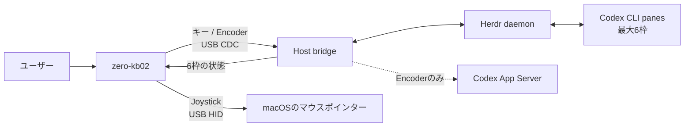

# codex-zero-kb02

zero-kb02から、Herdr上で動くCodex CLIエージェントを確認・操作するための非公式コントローラーです。

- [`host/`](https://github.com/hoki621/codex-zero-kb02-host): HerdrとUSB CDCをつなぐHost bridge
- [`firmware/`](https://github.com/hoki621/codex-zero-kb02-firmware): zero-kb02用TinyGo firmware

このプロジェクトはOpenAI、Work Louder、Herdr、Waveshare、および
[UPSTREAMS.md](UPSTREAMS.md)に記載したupstream projectの公式製品ではなく、提携・推奨を受けたものでもありません。

## できること



Host bridgeはHerdrの状態をzero-kb02へ送り、物理操作を許可済みの固定操作だけに変換します。
任意コマンドや任意文字列を送る機能はありません。

## 物理配置と操作

zero-kb02を正面から見たキー番号です。K1が左上です。

```text
┌────────┬────────┬────────┬────────┐
│ K1     │ K2     │ K3     │ K4     │
│ Escape │ Agent 1│ Agent 2│ Status │
├────────┼────────┼────────┼────────┤
│ K5     │ K6     │ K7     │ K8     │
│ Agent 3│ Agent 4│ Agent 5│ Agent 6│
├────────┼────────┼────────┼────────┤
│ K9     │ K10    │ K11    │ K12    │
│ Approve│ Reject │ 無効   │ /new   │
└────────┴────────┴────────┴────────┘
```

| 操作 | 動作 | 動作条件 |
| --- | --- | --- |
| K1 | Escapeを送る | focus中かつ割り当て済みのCodex pane |
| K2 / K3 | Agent slot 0 / 1へfocus | 対応するagentが存在する |
| K4 | HerdrのStatus popupを開閉 | popupはHerdr session全体で1つ |
| K5 / K6 / K7 / K8 | Agent slot 2 / 3 / 4 / 5へfocus | 対応するagentが存在する |
| K9 | 今回だけApprove（固定キー`y`） | focus中のCodex paneが`blocked` |
| K10 | Reject（固定キー`n`） | focus中のCodex paneが`blocked` |
| K11 | 何もしない | v1では予約済み |
| K12 | New Chat（固定コマンド`/new`） | focus中のCodex paneが`idle`または`done` |
| Encoderを時計回り | reasoning effortを1段階上げる | managed Codex CLIとApp Serverが動作中 |
| Encoderを反時計回り | reasoning effortを1段階下げる | managed Codex CLIとApp Serverが動作中 |
| Encoderを押す | 何もしない | v1ではHost操作なし |
| Joystickを倒す | マウスポインターを上下左右へ移動 | USB HIDとして動作 |
| Joystickを押す | 何もしない | v1では予約済み |

K9/K10は送信直前にもfocus、Codex identity、`blocked`状態、USB sessionを再確認します。
条件が変わった場合は何も送りません。Enterや永続承認は送りません。

## OLEDとLED

OLEDの6枠は、K2/K3/K5〜K8が選ぶAgent slotと同じ順序です。

```text
┌────────┬────────┐
│ slot 0 │ slot 1 │  ← K2 / K3
├────────┼────────┤
│ slot 2 │ slot 3 │  ← K5 / K6
├────────┼────────┤
│ slot 4 │ slot 5 │  ← K7 / K8
└────────┴────────┘
```

| 表示 | 状態 |
| --- | --- |
| `W` | working: 作業中 |
| `I` | idle: 入力待ち |
| `B` | blocked: 承認・回答待ち |
| `D` | done: 完了 |
| `U` | unknown: 状態不明 |
| `E` | empty: agent未割り当て |

## セットアップと起動

### 初回セットアップ

次の1〜3は、最初のセットアップ時だけ実行します。Firmwareを更新・復旧する場合を除き、毎回やり直す必要はありません。

#### 1. Cloneと依存関係の準備

```sh
git clone --recurse-submodules https://github.com/hoki621/codex-zero-kb02.git
cd codex-zero-kb02
mise install
cd host
npm ci
```

このParent commitは次のソースの組み合わせを固定します。HostのPC側試験は完了しています。
Firmwareは変更しておらず、この組み合わせの実機受入は[Issue #32](https://github.com/hoki621/codex-zero-kb02/issues/32)で実施します。

| Component | Commit |
| --- | --- |
| Host | `85e06ac721f981b392f5a3953ce22aefe13b3533` |
| Firmware | `4d8104c5b4f3925b37394b0ca2d14c39486fc9a1` |

#### 2. Firmwareを書き込む

対象がzero-kb02であることを確認し、実機操作の明示許可を得てから実行します。

```sh
cd ../firmware
tinygo build -o /absolute/path/zero-kb02.uf2 --target waveshare-rp2040-zero --stack-size 8kb --size short .
tinygo flash --target waveshare-rp2040-zero --stack-size 8kb .
```

`tinygo flash`で書き込めない場合は、Host bridgeを停止してから
[`firmware/docs/hardware-diagnostics.md`](firmware/docs/hardware-diagnostics.md)のBOOTSEL/RST手順を使います。

#### 3. Herdr pluginを登録する

これは初回だけ必要です。ローカルの固定manifest `hoki621.zero-kb02`と、読み取り専用のStatus popupを登録します。

```sh
cd ../host
npm run build
npm link
herdr plugin link --enabled "$(pwd)"
cd ..
```

このコマンドはHerdrのplugin registryを変更します。Host bridgeが自動実行することはありません。

#### 過去版のSessionStart hookを削除する（更新時のみ）

過去版で`npm run install-codex-hook`を実行した場合だけ、Codexを終了してから`~/.codex/hooks.json`をバックアップし、
`SessionStart`内の`command`が次の形になっているhookオブジェクトだけをテキストエディタで削除します。

```sh
cp -ip "$HOME/.codex/hooks.json" "$HOME/.codex/hooks.json.before-zero-kb02-manual"
```

```text
node '/absolute/path/to/codex-zero-kb02/host/dist/src/codex-hook.js'
```

`SessionStart`配列全体やSerena・Herdrなど他のhookは削除しないでください。保存後、JSONが壊れていないことを確認します。

```sh
python3 -m json.tool "$HOME/.codex/hooks.json" >/dev/null
```

新規セットアップではCodex hookの導入・削除は不要です。

### 毎回の起動

zero-kb02をUSB接続し、次の1〜3を順番に実行します。

#### 1. Encoderを使う場合

Homebrew caskのCodexを用意し、通常Terminalで専用App Serverを起動したままにします。

```sh
brew install --cask codex   # 未導入の場合だけ
codex-micro doctor
codex-micro server
```

CLIとApp Serverは同じbrew管理の実体を使用します。`codex-micro doctor`でパス・版・専用socketを確認できます。
`server`はforegroundで動作し、多重起動を拒否します。standalone用daemonの起動や既存インストールの削除は行いません。
App Serverがない場合はEncoderのreasoning変更のみ利用できません。

#### 2. Host bridgeを起動する

Herdr管理paneではなく、macOSの通常Terminalから実行します。Herdr再起動後もbridgeを残すためです。

```sh
cd host
HERDR_SOCKET_PATH="$HOME/.config/herdr/herdr.sock" \
ZERO_KB02_PORT=/dev/cu.usbmodemzero_kb02_v11 \
npm start
```

USB CDC deviceが1台だけなら`ZERO_KB02_PORT`は省略できます。複数ある場合は、必ず対象の
`/dev/cu.usbmodem*`を明示してください。停止は同じTerminalで`Ctrl-C`です。

#### 3. HerdrでCodex CLIを使う

Herdr上でCodex CLI paneを起動すると、最大6つまでOLED/LEDへ表示されます。Encoderを使うpaneは次の1コマンドで起動します。

```sh
codex-micro
```

`codex-micro`は専用App ServerへWebSocketメッセージを中継し、`thread/start`、`thread/resume`、
`thread/fork`の応答に含まれるUUIDv7をrequest IDで対応付け、現在のHerdr paneへ
自動登録します。`/new`後も自動で再登録します。pane IDやthread IDを推測せず、
値が不正・曖昧な場合は登録もEncoder操作も行いません。

## 復旧

- **USBを抜き差しした:** Host bridgeはそのままにします。指定portへ再接続し、handshake後に6枠の全状態を再送します。
- **Herdrを再起動した:** 通常Terminal上のHost bridgeがHerdr socketへ再接続し、枠を作り直します。5秒ごとのreconcileで欠落イベントも補います。
- **Host bridgeを再起動した:** 「毎回の起動 2」と同じ環境変数で再起動します。古いUSB sessionの入力は再利用されません。
- **Codexをbrewで更新した:** remote CLIを終了し、専用サーバーのTerminalでCtrl-C後に`codex-micro server`を再実行します。その後Herdrで`codex-micro resume`を起動します。Host bridgeの再起動はApp Serverを停止しません。
- **専用サーバーの異常終了後に起動できない:** `codex-micro doctor`と[Hostの復旧手順](host/README.md#pc-setup-and-startup)で所有PID/socketを確認します。稼働中のサーバーのディレクトリを削除しないでください。
- **Firmwareを復旧したい:** Host bridgeを停止し、[`firmware/docs/hardware-diagnostics.md`](firmware/docs/hardware-diagnostics.md)を使います。flashとBOOTSEL/RSTには毎回明示許可が必要です。

## 更新

検証済みの組み合わせを崩さないため、Parent commit単位で更新します。

```sh
git pull --ff-only
git submodule update --init --recursive
mise install
cd host
npm ci
```

`git submodule update --remote`は使わないでください。

## 制約

- v1は最大6つのCodex agentを扱います。HerdrはJSON APIの必須フィールドを検証し、内部protocol番号だけでは拒否しません。Herdr 0.9.0の生成schemaを参照し、mockで互換性を確認しています。
- Codexはbrew版0.155.1を隔離環境で検証済みです。必要な実験APIが欠ける版ではEncoder処理を停止して理由を記録します。
- K9/K10の対応承認画面の検証は[Issue #25](https://github.com/hoki621/codex-zero-kb02/issues/25)で未完了です。現行の`blocked`判定だけでは質問待ちと承認待ちを区別できません。
- macOSのUSB自動探索は`/dev/cu.usbmodem*`だけが対象です。
- K4はHerdr session全体のpopupを操作するため、別pluginのpopupを閉じる場合があります。
- launchd service、自動起動、設定GUI、Vial control、任意shell command、任意文字列、永続承認、K11 push-to-talk、model切替、Codex Desktop App、Zed ACPには対応しません。

## キーボードなしで行える確認

```sh
cd host
npm ci
npm run typecheck
npm test
npm run dry-run -- WIBDUE
npm run smoke:codex
```

`smoke:codex`はbrew版App Serverを一時CODEX_HOMEで起動し、初回発言前のephemeral会話でreasoningを1段階変更します。
モデルへの発言・実Herdrへの入力・USB接続は行いません。試験終了時に専用プロセスと一時領域を削除します。

Hostの50テスト、typecheck、clean build、dry-run、brew版0.155.1の隔離API試験が成功しています。
実Herdrの対話画面、物理キー、Encoder実回転、OLED/LED、USB抜き差し、flashは未実施です。
ライブラリ中心のFirmware・新USB契約・本人の作業手順は[計画 #34](https://github.com/hoki621/codex-zero-kb02/issues/34)を参照してください。

## 開発workflow

作業は[Parent issue tracker](https://github.com/hoki621/codex-zero-kb02/issues)で管理します。Child repositoryではIssueを使いません。

1. 1つのIssueを選び、指定されたrepositoryだけを変更する
2. Child repositoryを先にcommit・pushする
3. Issueに対応した最小の検証を行う
4. integration時だけParentのsubmodule pointerを更新する

## 安全

Firmware flash、serial portのopen、実USB/device control、Herdr paneへのlive入力は、対象操作ごとにユーザーの明示許可を得てから行ってください。
build、mock test、read-only確認は実機を操作しません。
