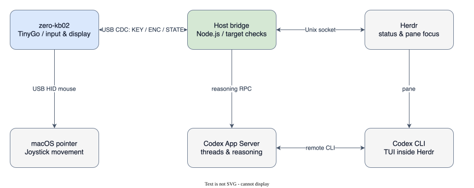

# zero-kb02 Codex controller

[日本語](README.md)

A personal macOS controller that displays and operates up to six Codex CLI sessions in Herdr using the keys, encoder, OLED and LEDs of a zero-kb02 (RP2040). The joystick moves the mouse pointer.

[Demo video on X](https://x.com/hoki621/status/2093605017819423047) · [Verification record](docs/verification.md)



Firmware handles input and display. The Host checks Herdr state and the operation target. Encoder changes to reasoning effort go through a dedicated Codex App Server. The SVG can be edited in draw.io.

## Setup

Requirements: macOS, zero-kb02, Herdr, Homebrew and mise. Existing installations can be reused. `mise.toml` pins Node.js, Go and TinyGo; the launcher uses Homebrew Codex CLI.

```sh
git clone --recurse-submodules https://github.com/hoki621/codex-zero-kb02.git
cd codex-zero-kb02
mise install                 # Only if the pinned versions are missing
mise exec -- sh -c 'cd host && npm ci && npm run build'
brew install --cask codex    # Only if missing
herdr plugin link --enabled "$PWD/host"
```

Install Herdr using its [official instructions](https://herdr.dev/), and authenticate Codex CLI before starting. The launcher selects the brew binary without editing existing Codex configuration files.

See [Firmware setup](firmware/README.md) for building and flashing. Host and Firmware must both use USB CDC **major 2**. Major 1 firmware is incompatible.

## Run

Run these commands from the repository root. Use the same `TMPDIR=/tmp` in every terminal: otherwise terminals inside and outside Herdr may look for the dedicated server in different directories.

1. Keep the dedicated server running in a normal Terminal:

   ```sh
   TMPDIR=/tmp mise exec -- node host/dist/src/codex-micro.js server
   ```

2. Start a CLI in each Herdr pane, up to six. Append `resume` to resume a conversation.

   ```sh
   TMPDIR=/tmp mise exec -- node host/dist/src/codex-micro.js
   ```

3. Start the bridge in another normal Terminal. Specify the exact device port and close other serial monitors.

   ```sh
   TMPDIR=/tmp HERDR_SOCKET_PATH="$HOME/.config/herdr/herdr.sock" \
   ZERO_KB02_PORT=/dev/cu.usbmodemzero_kb02_v21 \
   mise exec -- node host/dist/src/main.js
   ```

Stop with Ctrl-C. Finish all connected CLI sessions before stopping the server. After a brew Codex upgrade, restart the server and resume each CLI session.

## Controls

Numbering starts at the top left: K1–K4, then K5–K8, then K9–K12.

| Input | Action |
| --- | --- |
| K1 | Escape in the focused Codex pane |
| K2 / K3 / K5 / K6 / K7 / K8 | Focus agent slots 1–6 |
| K4 | Open/close the status popup |
| K9 / K10 | Fixed approve/deny once for a verified single command approval |
| K11 | Unassigned |
| K12 | New conversation when the focused Codex is idle/done |
| Encoder | Clockwise increases reasoning effort; counterclockwise decreases it |
| Joystick | Pointer movement; both push inputs are unassigned |

OLED slots are arranged as 1/2, 3/4, 5/6. W=working, I=idle, B=blocked, D=done, U=unknown and E=empty.

Approval keys support Codex CLI **0.155.1 and 0.160.0 only**, and require matching thread, terminal, pending request and visible prompt evidence. They are disabled on 0.162.0 and were omitted from the pre-demo check. K4 may close another Herdr plugin's shared popup.

## Development and updates

```sh
mise exec -- sh -c 'cd host && npm run typecheck && npm test && npm run dry-run -- WIBDUE'
mise exec -- sh -c 'cd firmware && go test ./... && go vet ./...'
```

These checks need no device. To update: `git pull --ff-only`, `git submodule update --init --recursive`, then `npm ci` and build in Host. Avoid `git submodule update --remote`: use the combination pinned by the parent commit.

- [Host details and recovery](host/README.md) / [Firmware](firmware/README.md)
- [Wire contract](PROTOCOL.md) / [Upstream licenses](UPSTREAMS.md)
- [Remaining checks #32](https://github.com/hoki621/codex-zero-kb02/issues/32)

Matrix/debounce and device drivers use pinned upstream libraries. No workshop source is copied. Each child repository records provenance and retained notices. The project's own code does not yet have a license.
